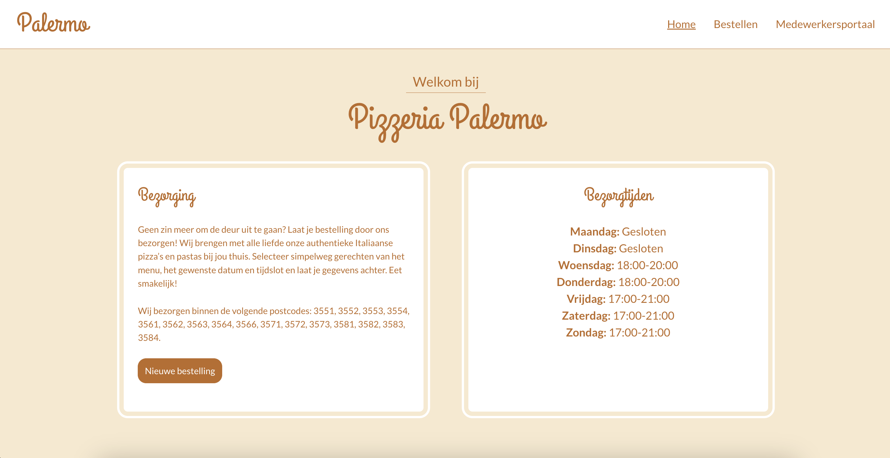

# Installatiehandleiding - Pizzeria Palermo 

## Inhoudsopgave
1. [Inleiding](#inleiding)
2. [Project clonen](#stap-1-project-clonen)
3. [Dependencies installeren & applicatie starten](#stap-2-dependencies-installeren--applicatie-starten)
4. [API-configuratie](#stap-3-api-configuratie)
5. [Omgevingsvariabelen instellen](#stap-4-omgevingsvariabelen-instellen)
6. [Bestaande accounts](#stap-5-bestaande-accounts)
7. [Applicatie starten](#stap-6-applicatie-starten)

---

---

## Inleiding
Dit project is mijn eindopdracht voor de bootcamp frontend development bij Novi Hogeschool te Utrecht. 

Deze applicatie is ontwikkeld voor **Pizzeria Palermo**, een fictief Italiaans restaurant. Dit zijn de belangrijkste functionaliteiten:

- Klanten kunnen bestellingen plaatsen
- Medewerkers kunnen bestellingen beheren
- Admins kunnen het menu aanpassen
- Medewerkers en admins kunnen inloggen. Daarnaast kunnen admins nieuwe gebruikers registreren.

**Tech stack**: React, Vite, HTML, CSS, JavaScript.

Hieronder vind je een stappenplan om het project lokaal op te zetten, te configureren en te draaien.

---

## Stap 1: project clonen
1. Open **WebStorm**.
2. Klik op **File** -> **New** -> **Project from version control**
3. Plak de GitHub-repo URL: https://github.com/TJones98/final-assesment-novi-pizzeria-app-new.git
4. Kies een lokale map en bevestig met **Clone**.

---

## Stap 2: dependencies installeren
1. Open de terminal in WebStorm.
2. Type het volgende commando in om alle dependencies binnen te halen: npm install.

---

## Stap 3: API configuratie
Deze applicatie communiceert met de volgende externe API: [NOVI Dynamic API](https://novi-backend-api-wgsgz.ondigitalocean.app/).
Configureer de API op de volgende wijze:
1. Upload het configuratiebestand database.config.json (te vinden in de root van het project).
    - Let op: dit bestand staat niet op de versie die naar GitHub gepusht is. De examinatoren hebben dit bestand ontvangen in de .zip bestand van het project.
2. Vul het Project ID in (staat in het .rtf bestand dat de examinatoren hebben ontvangen).

---

## Stap 4: omgevingsvariabelen instellen
1. Maak een .env-bestand aan in de root (kopieer .env.dist als sjabloon).
2. Vul de variabel-namen in volgens .env.dist. 
   - De examinatoren ontvangen de waardes van de variabelen in een .rtf bestand
3. Run het volgende commando in de terminal: npm run build

---

## Stap 5: bestaande accounts
Er zijn al twee testaccounts beschikbaar in database.config.json:

- Admin: Voor menu- en gebruikersbeheer.
- Medewerker: Voor bestellingsbeheer.

---

## Stap 6: applicatie starten

1. Type het volgende commando in de terminal: npm run dev.
2. De applicatie opent automatisch in je browser op http://localhost:5173.

---

Als het goed is heb je nu alle informatie om het project lokaal op te zetten. Vragen? Laat het weten! 

